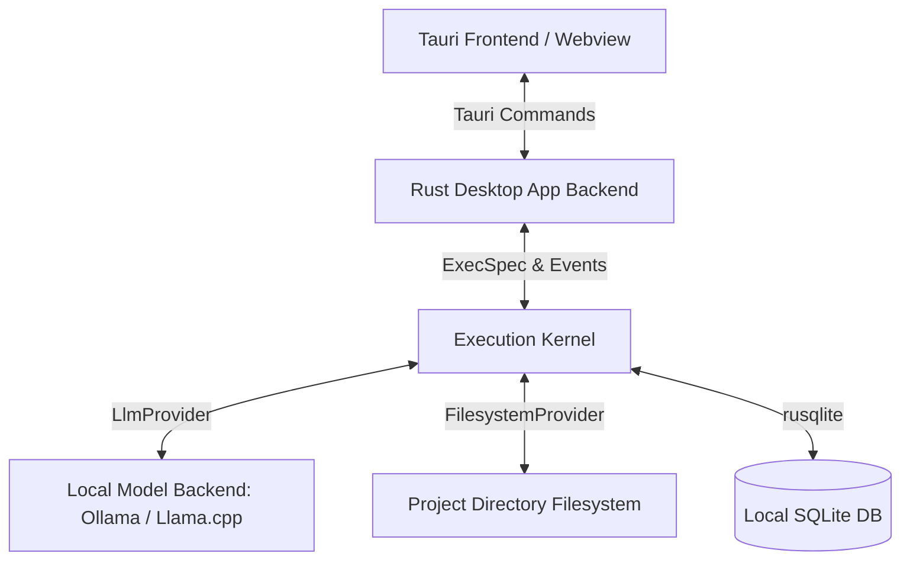

# Desktop Product Architecture Notes

В данном документе представлена архитектура десктопного приложения для детерминированного запуска локальных ИИ-агентов на базе `deterministic_ai_kernel`.

---

## 1. Стек технологий

* **Frontend/UI:** Tauri + Svelte/React. Tauri позволяет создавать легковесные нативные приложения на Rust с веб-интерфейсом.
* **Backend:** `deterministic_ai_kernel` интегрируется в Tauri-приложение как Rust-библиотека (crate).
* **Локальные модели:** Llama.cpp / Ollama / MLX Local, запущенные на локальной машине разработчика.
* **База данных:** SQLite (через `rusqlite`), встроенная в приложение.

---

## 2. Архитектура взаимодействия

---

## 3. Ключевые возможности пользователя (User Flows)

### Flow 1: Выбор локальной модели и настройка
* Пользователь указывает URL локального бэкенда (например, `http://localhost:11434` для Ollama) и выбирает модель (Qwen2.5-Coder, Gemma-2b-it, Mistral-7b).
* Приложение опрашивает локальный бэкенд (поддерживает OpenAI API совместимый протокол) и сохраняет конфигурацию.

### Flow 2: Выбор проекта и запуск задачи
* Пользователь указывает путь к локальному Git-репозиторию.
* Пользователь вводит описание задачи (например, "Исправить ошибку деления на ноль в модуле калькулятора").
* Приложение компилирует задачу в `ExecSpec` (CodeFix пайплайн).
* Задача записывается в SQLite, и запускается планировщик.

### Flow 3: Мониторинг выполнения (Execution Graph)
* UI в реальном времени отображает граф шагов ExecSpec (ReadRepository -> LocateBug -> PatchCode -> RunTests -> ValidatePatch).
* Статусы шагов (pending, ready, dispatched, committed, rejected) обновляются на основе событий в `event_log`.

### Flow 4: Просмотр лога доказательств (Evidence Log)
* После успешного завершения пайплайна или любого шага пользователь видит сгенерированные артефакты и метаданные моделей (включая хэш, версию и seed).
* Пользователь может запустить кнопку "Verify" для повторного детерминированного проигрывания (Replay) и сравнения полученных хэшей с оригинальными.

---

## 4. Требования к безопасности и детерминизму
1. **Изоляция окружения:** Все операции записи в репозиторий проекта выполняются исключительно через `FilesystemProvider` с поддержкой песочницы (Tauri scope).
2. **Фиксация версий:** Версии моделей и параметры генерации (temperature = 0.0, seed) всегда записываются в `model_metadata_v1` внутри лога событий.
