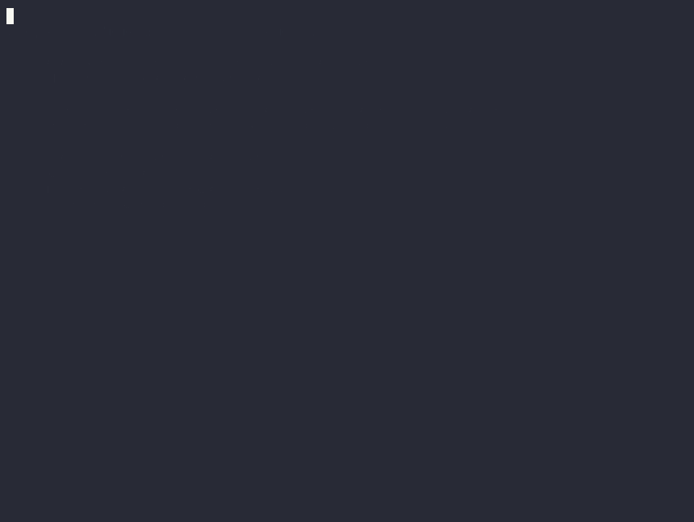

# deterministic_ai_kernel

> **License: all rights reserved.** This repository is publicly viewable
> for evaluation purposes only — no use, copy, or modification rights are
> granted. For pilots and licensing, see `PILOT_OFFER.md`.
> Contact: nface0@icloud.com

A deterministic Rust kernel for task execution, replay, snapshotting, and local model control.

**For engineering leads evaluating this as a product:** see `PILOT.md`
(what it is, measured results, why it's not another observability tool),
`PILOT_OFFER.md` (4-week paid pilot terms), and `DEMO_SCRIPT_60S.md`
(live 60-second demo with verified commands).

**Demo (36 s, recorded live):**

## Core concepts

- `event_bus`: persistence layer for events and semantic artifacts.
- `scheduler`: selection layer only.
- `worker`: ownership and lease execution.
- `execution`: execution-only runtime.
- `workflow`: canonical task classes and step contracts.

## Semantic artifacts

Supported artifact types are:

- `analysis_seed`
- `retrieval_result`
- `classification`

CLI commands:

- `semantic-artifacts <task_id> [step_id]`
- `latest-analysis-seed <task_id> [step_id]`

## Demo workflow

Example end-to-end walkthrough:

1. Analyze a task:
   - `cargo run -- analyze-task demo-task "Investigate scheduler retry semantics"`

2. Read the latest semantic seed:
   - `cargo run -- latest-analysis-seed demo-task analyze_task`

3. List semantic artifacts for the task:
   - `cargo run -- semantic-artifacts demo-task`

4. Rebuild snapshot state:
   - `cargo run -- snapshot demo-task`

5. Replay persisted state:
   - `cargo run -- replay demo-task`

This demonstrates the intended loop: analyze -> persist semantic artifact -> inspect artifact state -> snapshot -> replay.

## LM backend in tests

The test suite runs against a mock LM backend by default — the tests set
`DAK_LM_BACKEND=mock` themselves, so no local model or running LM server
is required for `./ct`.

## Developer Experience (DX) Test Runner: `./ct`

To run tests with a clean, noise-free output, use the `./ct` wrapper script. It silences warnings and compilation noise on success, and outputs only clean compiler errors or test failures on fail. All agents and developers should run this command instead of direct `cargo test` to improve developer experience.

### Examples:
- Run all tests: `./ct`
- Pass features/targets: `./ct --all-targets --all-features`
- Run a specific integration test suite: `./ct scheduler_integration`
- Run a specific test: `./ct --test artifact_immutability`

## Useful tests (under `./ct`)

- `./ct --test replay_snapshot`
- `./ct --test scheduler_integration`
- `./ct --test semantic_artifacts`
- `./ct --test semantic_artifacts_cli`
- `./ct --test semantic_artifacts_list_cli`
- `./ct --test semantic_artifact_contract`

## Current status

- Replay/snapshot on clean DB is stable.
- Default DB path is absolute.
- Semantic artifact contract is explicitly tested.

## Semantic Bias V1 Rule

Semantic Bias V1 is a sealed contract.
Any change requires version increment and explicit test updates.
